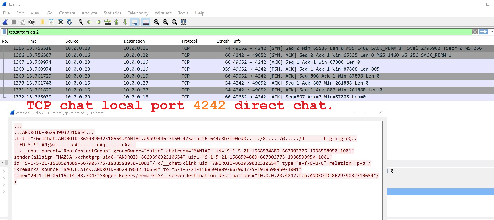
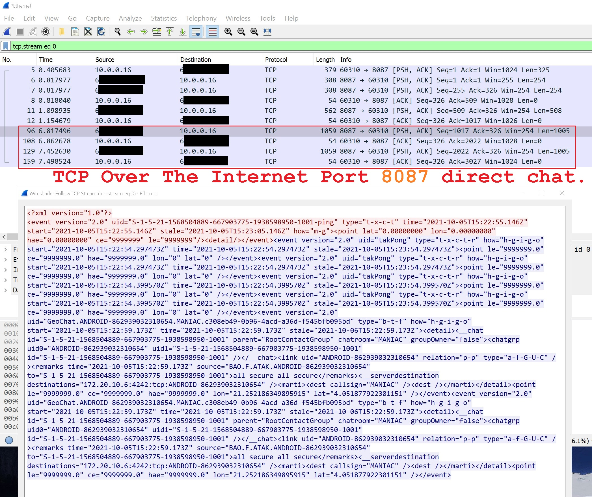
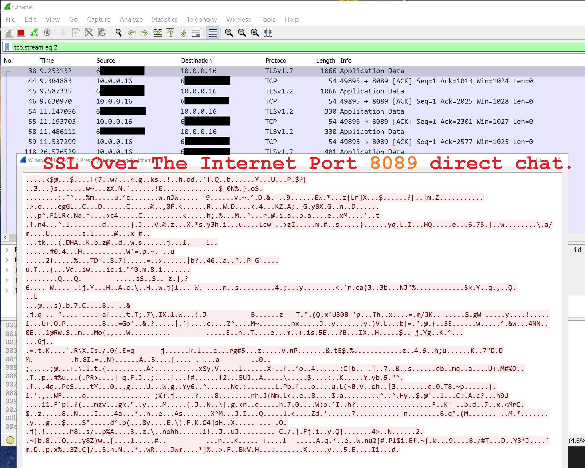

# FreeTAKServer ESP8266 Sensor

A repository containing the Arduino sketch for the `ESP8266`. 

It allows the `ESP8266` to show up on the `FreeTAKServer` and can control event triggers using keywords like "open" via the group chat console in `ATAK-CIV` and `WINTAK-CIV`.

## Quick example use cases

A Gate sensor shows up on `ATAK-CIV` in a specific geolocation It has an `ESP8266` controlling the motor. 

Now I can type open in the group chat on my Mobile device and the gate will open.

Other examples are pyrotechnics for airsoft or an alarm alert connected to a magnetic reed switch or PIR sensor etc.

The GPS coordinates are hardcoded for the `ESP8266` but an arduino with a GSM module can act as an affordable DIY GPS device with TX and RX support.

## Local TCP example

TCP communication via port **_4242_** on the local LAN network (unsecure)

## Internet TCP example

TCP communication via port **_8087_** over the internet (unsecure)

## Internet SSL example

SSL communication via port **_8089_** over the internet (secure)

## Notes

* Works on `FTS 1.9.5` (Only tested on this version of FTS).
* Shows up as a WINTAK device at the moment.
* Send Commands via the GroupChat option direct chat does not work
* Tested on `ESP-01`, `WemosD1 Mini` and `Node MCU` + `CH340 clone`.
